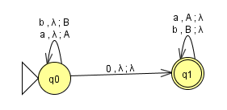
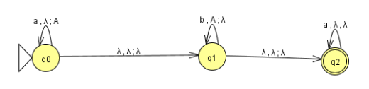

## Lista 3 da materia de FTC 
5 período Puc Minas  
Aluno: Matheus Luiz Oliveira Spindula  
Matricula: 623473   

Questão 5. Para cada uma das gramáticas a seguir, obtenha uma gramática equivalente na FNC. 

a)  
S →  aAbB |  ABC  |  a   
A →  aA   |  a  
B →  bBcC |  b  
C →  abc  

---------------------
1. Aumentar a gramatica se necessário    
    S →  aAbB |  ABC  |  a   
    A →  aA   |  a  
    B →  bBcC |  b  
    C →  abc  
---------------------
2. Eliminar produções lambdas  
    S →  aAbB |  ABC  |  a   
    A →  aA   |  a  
    B →  bBcC |  b  
    C →  abc  
---------------------
3. Eliminar as cadeias   
    S →  aAbB |  ABC  |  a   
    A →  aA   |  a  
    B →  bBcC |  b  
    C →  abc  
---------------------
4. Eliminar símbolos inúteis    
    4.1 Não produzem terminal.  
        S →  aAbB |  ABC  |  a   
        A →  aA   |  a  
        B →  bBcC |  b  
        C →  abc  

    --------------------
    4.2 Eliminar as variáveis que não são alcançáveis  
        S →  AbB |  ABC  |  A   
        A →  aA   |  a  
        B →  bBcC |  b    
        C →  abc  

--------------------
5.           
    S →  AB1 |  AB3  |  a   
    A →  A1A | a
    A1 →  a  
    B →  B1C |  b   
    B1 →  B2B  
    B2 → b  
    B3 → BC  
    C → C3C2    
    C3 → c    
    C2 → C1C  
    C1 → AB  
--------------------
b)  
S →  A  |  ABa |  AbA  
A →  Aa   |   λ  
B →  Bb   |  BC  
C →  CB  |  CA  |  bB  

---------------------
   1. Aumentar a gramatica se necessário
    S →  A  |  ABa |  AbA  
    A →  Aa   |   λ  
    B →  Bb   |  BC  
    C →  CB  |  CA  |  bB  

---------------------
   2. Eliminar produções lambdas   
    S →  A  |  ABa |  AbA | Ba | Ab | bA | b   
    A →  Aa  |  a   
    B →  Bb  |  BC    
    C →  CB  |  CA  |  bB   
   
--------------------
   3. Eliminar as cadeias 
    S →  A  |  ABa |  AbA | Ba | Ab | bA | b   
    A →  Aa  |  a   
    B →  Bb  |  BC    
    C →  CB  |  CA  |  bB 
    Cadeias {S}
    
        ---------------------
        S →  Aa | a | ABa | AbA | Ba | Ab | bA | b   
        A →  Aa  |  a   
        B →  Bb  |  BC    
        C →  CB  |  CA  |  bB 

---------------------
   4. Eliminar símbolos inúteis    
       4.1 Não produzem terminal.  
            S →  Aa | a | ABa | AbA | Ba | Ab | bA | b   
            A →  Aa  |  a   

       --------------------
       4.2 Eliminar as variáveis que não são alcançáveis  
            S →  A | AbA | Ab | bA | b   
            A →  Aa| a   
---------------------
5. 
    S → A | BA | B | BA  | b   
    A → AA1|  A1   
    A1 → a  
    B1 → B2A   
    B2 → b  

---------------------
c)  
S →  ABC  
A →  a   
B →  b   |  bb  
C →  BaB   |  c  

---------------------
1. Aumentar a gramatica se necessário
    S →  ABC  
    A →  a   
    B →  b   |  bb  
    C →  BaB   |  c  
---------------------
2. Eliminar produções lambdas  
    S →  ABC  
    A →  a   
    B →  b   |  bb  
    C →  BaB   |  c  
---------------------
3. Eliminar as cadeias  
    S →  ABC  
    A →  a   
    B →  b   |  bb  
    C →  BaB   |  c 
---------------------
4. Eliminar símbolos inúteis  
    4.1 Não produzem terminal.   
    &emsp;Expressões que produzem, T = {S,A,B,C}  
    S →  ABC  
    A →  a   
    B →  b  |  bb  
    C →  BaB|  c 

    ---------------------
    4.2 Eliminar as variáveis que não são alcançáveis  
    S →  ABC  
    A →  a   
    B →  b  
    C →  BaB|  c 

---------------------
5.     
    S →  ABC  
    A →  a   
    B →  b   
    C →  C1B|  c   
    C1 → BA
---------------------
d)  
S →  ADE  |  ABa |  AbA   
A →  Aa   |   λ  
B →  Bb   |  BC  
C →  CB  |  CA  |  bB  
D →  EdD  | E  
E →  bcdE  | D  

---------------------
1. Aumentar a gramatica se necessário
   
    S →  ADE  |  ABa |  AbA   
    A →  Aa   |   λ  
    B →  Bb   |  BC  
    C →  CB  |  CA  |  bB  
    D →  EdD  | E  
    E →  bcdE  | D

---------------------
2. Eliminar produções lambdas
   
    Anuláveis {A}  

    S →  ADE | ABa | AbA | DE | Ba | bA | Ab | b   
    A →  Aa  | a  
    B →  Bb  | BC   
    C →  CB  | CA | bB   
    D →  EdD | E   
    E →  bcdE | D  

---------------------
3. Eliminar as cadeias  
    Cadeias {E,D}  
    S →  ADE | ABa | AbA | DE | Ba | bA | Ab | b     
    A →  Aa  | a  
    B →  Bb  | BC   
    C →  CB  | CA | bB      
    D →  EdD | bcdE   
    E →  bcdE | EdD | bcdE 

---------------------
4. Eliminar símbolos inúteis  
    4.1 Não produzem terminal.   
    &emsp;Expressões que produzem, T = {S,A}  
    S →  ADE | ABa | AbA | DE | Ba | bA | Ab | b       
    A →  Aa  | a  
    B →  Bb  | BC   
    C →  CB  | CA | bB      
    D →  EdD | bcdE   
    E →  bcdE| EdD | bcdE  

    ---------------------  
    S →  AbA | bA | Ab | b     
    A →  Aa  | a

    ---------------------
    4.2 Eliminar as variáveis que não são alcançáveis  
    R = {S,A}  
    S →  AbA | bA | Ab | b     
    A →  Aa  | a

---------------------
5.  
    S →  AB | B1A1 | AB1 | b     
    A →  AA1  | A1  
    A1 →  a  
    B → AB1    
    B1 → b  
--------------------- 

Questão 6. Prove usando o pumping lemma que as seguintes linguagens não são livres de contexto:  

a. { anbnanbn |  n > 0 }

Prove que L = {anbnanbn   | n > 0} não é LLC:  
z = uvwxy, onde:  
| vwx | <= 2k,  
| v | + | x | > 0 e,  
∀ i >= 0, uviwxiy ∈ L.  

Hipótese: L = {anbnanbn   | n > 0} é LLC

Considere uma Gramática Livre de Contexto G na FNC, com K variáveis. Seja z = anbnanbn , n = 2k. Como | z | = 4n = 4 * 2k e | z | >= 2k, pelo lema do bombeamento:  

1) v, x só conter 1 tipo de terminal  
1.1) a1’s.  

z =    a1n              b1na2nb2n
           u  vwx        y

é obvio que se bombearmos, aumentamos ou diminuímos o número de a1’s, mas não o número de b1’s, a2’s ou b2’s,   

1.2) análogo para b1’s, a2n e b2n

    z =    a1 n     b1n      a2nb2n
            u       vwx        y

    z =    a1 nb1n  a2n       b2n
            u       vwx        y

    z =    a1 nb1na2n  b2n
            u  vwx      y

2) v, x contendo 2 tipos de terminais  
2.0.1) v ou x conter a1’s e b1’s 

        z = a1n-2      a1a1 b1n-2      b1b1a2nb2n  
            u 		     vwx              y

bombeando v ou x, por exemplo v = a1b1, z = a1’s a1b1 a1b1 a1b1 a2 ‘s b2 ‘s, perde a ordem, z ∉ L.  

*análogo para b1’s e a2’s  
*análogo para a2’s e b2’s  

*Para a1’s e a2’s é impossível! (Viola regra 1)

*análogo para b1’s e b2’s

2.1)
 v conter a1’s e x conter b1’s  

    z =    a1n-2     a1a1      b1n-4     b1b1     b1b1a2nb2n    
            u         v         w       x            y

bombeando aumenta ou diminui o número de a1’s e b1’s igualmente: q = a1ib1ia2nb2n, mas não altera o número de  a2n e b2n : q ∉ L!    

*análogo para v conter b1’s e x conter a2’s    
*análogo para v conter a2’s e x conter b2’s  

*Para v conter a1’s e x conter a2’s é impossível! (Viola a regra 1)    
*análogo para v conter b1’s e x conter b2’s    
*análogo para v conter a1’s e x conter b2’s

3)v, x contendo 3 ou 4 tipos de terminais é impossível por violar a regra 1!

ABSURDO! L não é uma LLC

b) {0n12n2n | n > 0}  
Prove que L = {0n1n1n2n  | n > 0} não é LLC:    
z = uvwxy, onde:  
- | vwx | <= 2k,  
- | v | + | x | > 0 e,  
- ∀ i >= 0, uviwxiy ∈ L.  

Hipótese: L = {0n1n1n2n   | n > 0} é LLC

Considere uma Gramática Livre de Contexto G na FNC, com K variáveis. Seja z = 0n1n1n2n , n = 2k. Como | z | = 4n = 4 * 2k e | z | >= 2k, pelo lema do bombeamento:  

1)v, x só conter 1 tipo de terminal  
    1.1) 0’s.

    z =    0n  1an1bn 2n
           u    vwx        y

é obvio que se bombearmos, aumentamos ou diminuímos o número de 0’s, mas não o número de 1a’s, 1b’s ou 2’s,   
    1.2) análogo para 1a’s, 1b’s e 2’s 

    z =    0n          1an      1bn 2n
           u       vwx        y

    z =    0n 1an      1bn           2n
            u          vwx           y

    z =    0n 1an 1bn 2n
            u   vwx   y

2)v, x contendo 2 tipos de terminais  
2.0.1) v ou x conter 0’s e 1a’s  

    z = 0n-2      00 1an-2      1a1a1bn2n
        u 	          vwx            y

bombeando v ou x, por exemplo v = 01a, z = 0’s 01a 01a 01a 1b ‘s 2 ‘s, perde a ordem, z ∉ L.

-análogo para 1a’s e 1b’s  
-análogo para 1b’s e 2’s

-Para 0’s e 1b’s é impossível! (Viola regra 1)

-análogo para 1a’s e 2’s

2.1)v conter 0’s e x conter 1a’s

    z =    0n-2        00       1an-4     1a1a     1a1a1bn2n
            u         v         w          x            y

bombeando aumenta ou diminui o número de a1’s e b1’s igualmente: q = 0i1ai1bn2n, mas não altera o número de 1bn e 2n : q ∉ L!  

-análogo para v conter 1a’s e x conter 1b’s  
-análogo para v conter 1b’s e x conter 2’s

-Para v conter 0’s e x conter 1b’s é impossível! (Viola a regra 1)  
    -análogo para v conter 1a’s e x conter 2’s  
    -análogo para v conter 0’s e x conter 2’s  

3)v, x contendo 3 ou 4 tipos de terminais é impossível por violar a regra 1!

ABSURDO! L não é uma LLC

c. {wwRw | w ∈ {a, b}*}  
Prove que L = {wwRw   | w ∈ {a, b}*}

z = uvwxy, onde:  
- | vwx | <= 2k,  
- | v | + | x | > 0 e,  
- ∀ i >= 0, uviwxiy ∈ L.  

Hipótese: L = {wwRw   | w ∈ {a, b}*} é LLC  

Considere uma Gramática Livre de Contexto G na FNC, com K variáveis. E considere w = anb Seja z = anbbananb , n = 2k. Como | z | = 3n = 3 * 2k e | z | >= 2k, pelo lema do bombeamento:  

1)v, x só conter 1 tipo de terminal  
 1.1) a’s  

    z =    a1n  bba2na3n  b
             u   vwx      y

é obvio que se bombearmos, aumentamos ou diminuímos o número de a1’s, mas não o número de a2’s, a3’s,
1.2)  análogo para a2’s e a3n e b’s   

    z =    a1 nbb     a2n        a3nb  
            u         vwx        y

2)v, x contendo 2 tipos de terminais
2.0.1) v ou x conter a1’s e b’s

    z = a1n-2      a1a1 b      ba2na3nb    
         u 	          vwx              y

bombeando v ou x, por exemplo v = a1b, z = a1’s a1b a1b a1b ba2 ‘s a3 ‘s b’s, perde a ordem, z ∉ L.

-análogo para b’s e a2’s  
-análogo para a2’s e a3’s

-Para a1’s e a2’s é impossível! (Viola regra 1)

-análogo para b’s e a3’s

2,1)v conter a1’s e x conter b’s  

        z = a1n-2 a1a1 b b a2na3nb    
            u     v    w x    y  

bombeando aumenta ou diminui o número de a1’s e b’s igualmente: q = a1ibbia2na3nb, mas não altera o número de a2n ,a3n  e b : q ∉ L!

-análogo para v conter b’s e x conter a2’s
-análogo para v conter a2’s e x conter a3’s

-Para v conter a1’s e x conter a2’s é impossível! (Viola a regra 1)      
    -análogo para v conter b’s e x conter a3’s    
    -análogo para v conter a2’s e x conter b’s  

3) v, x contendo 3 ou 4 tipos de terminais é impossível por violar a regra 1!  

ABSURDO! L não é uma LLC

Questão 7. Construa autômatos de pilha que reconheçam as seguintes linguagens:

a. { w0wR   |  w ∈ { a, b }* }  
      
b. { anbnam  |  n, m ≥ 0 }  
      
c. { w  |  w ∈ { a, b, c }* e o primeiro c seja precedido por aaa }

